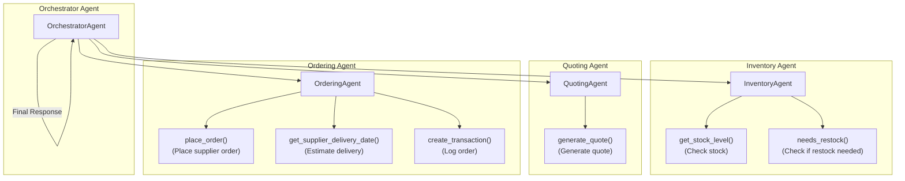

# Munder Difflin Multi-Agent System Project

Welcome to the starter code repository for the **Munder Difflin Paper Company Multi-Agent System Project**! This repository contains the starter code and tools you will need to design, build, and test a multi-agent system that supports core business operations at a fictional paper manufacturing company.

## Project Context

You’ve been hired as an AI consultant by Munder Difflin Paper Company, a fictional enterprise looking to modernize their workflows. They need a smart, modular **multi-agent system** to automate:

- **Inventory checks** and restocking decisions
- **Quote generation** for incoming sales inquiries
- **Order fulfillment** including supplier logistics and transactions

Your solution must use a maximum of **5 agents** and process inputs and outputs entirely via **text-based communication**.

This project challenges your ability to orchestrate agents using modern Python frameworks like `smolagents`, `pydantic-ai`, or `npcsh`, and combine that with real data tools like `sqlite3`, `pandas`, and LLM prompt engineering.

---

## What’s Included

From the `project.zip` starter archive, you will find:

- `project_starter.py`: The main Python script you will modify to implement your agent system
- `quotes.csv`: Historical quote data used for reference by quoting agents
- `quote_requests.csv`: Incoming customer requests used to build quoting logic
- `quote_requests_sample.csv`: A set of simulated test cases to evaluate your system

---

## Workspace Instructions

All the files have been provided in the VS Code workspace on the Udacity platform. Please install the agent orchestration framework of your choice.

## Local setup instructions

1. Install dependencies

Make sure you have Python 3.8+ installed.

You can install all required packages using the provided requirements.txt file:

`pip install -r requirements.txt`

If you're using smolagents, install it separately:

`pip install smolagents`

For other options like pydantic-ai or npcsh[lite], refer to their documentation.

2. Create .env File

Add your OpenAI-compatible API key:

`UDACITY_OPENAI_API_KEY=your_openai_key_here`

This project uses a custom OpenAI-compatible proxy hosted at https://openai.vocareum.com/v1.

## How to Run the Project

Start by defining your agents in the `"YOUR MULTI AGENT STARTS HERE"` section inside `template.py`. Once your agent team is ready:

1. Run the `run_test_scenarios()` function at the bottom of the script.
2. This will simulate a series of customer requests.
3. Your system should respond by coordinating inventory checks, generating quotes, and processing orders.

Output will include:

- Agent responses
- Cash and inventory updates
- Final financial report
- A `test_results.csv` file with all interaction logs

---

## Tips for Success

- Start by sketching a **flow diagram** to visualize agent responsibilities and interactions.
- Test individual agent tools before full orchestration.
- Always include **dates** in customer requests when passing data between agents.
- Ensure every quote includes **bulk discounts** and uses past data when available.
- Use the **exact item names** from the database to avoid transaction failures.

---

## Submission Checklist

Make sure to submit the following files:

1. Your completed `template.py` or `project_starter.py` with all agent logic
2. A **workflow diagram** describing your agent architecture and data flow
3. A `README.txt` or `design_notes.txt` explaining how your system works
4. Outputs from your test run (like `test_results.csv`)

---

## Agent Workflow Diagram

The following diagram illustrates the architecture of the multi-agent system, including agent responsibilities, orchestration logic, and the specific tools (helper functions) each agent uses. The system is composed of four main agents, each with explicitly defined, non-overlapping responsibilities, and a clear orchestration/data flow:

- **Orchestrator Agent**: Receives customer requests, coordinates all other agents, and manages the workflow.
- **Inventory Agent**: Checks current stock levels, triggers restocking if needed, and provides inventory status to the orchestrator.
- **Quoting Agent**: Generates quotes based on customer requests, inventory status, and historical data.
- **Ordering Agent**: Handles supplier orders and logistics when inventory is insufficient.

### Agent-Tool Interaction Diagram

### Agent Tools and Purposes

| Agent              | Tool/Function                | Purpose                                      |
|--------------------|-----------------------------|----------------------------------------------|
| Inventory Agent    | get_stock_level()           | Check current stock for an item              |
| Inventory Agent    | needs_restock()             | Determine if restocking is needed            |
| Quoting Agent      | generate_quote()            | Generate a quote for a customer request      |
| Quoting Agent      | (uses get_stock_level)      | (Checks stock as part of quoting)            |
| Ordering Agent     | place_order()               | Place an order with supplier                 |
| Ordering Agent     | get_supplier_delivery_date()| Estimate delivery date for supplier order    |
| Ordering Agent     | create_transaction()        | Log stock order transaction                  |
| Orchestrator Agent | handle_request()            | Orchestrate workflow and agent interactions  |

### Orchestration Logic & Data Flow

1. Orchestrator receives a customer request.
2. Inventory Agent checks stock (get_stock_level) and reports to Orchestrator.
3. If stock is low, Orchestrator triggers Ordering Agent to restock (place_order, get_supplier_delivery_date, create_transaction).
4. Quoting Agent generates a quote (generate_quote, may use get_stock_level) using inventory and past data.
5. Orchestrator compiles the final response and sends it to the customer.

This architecture ensures clear, non-overlapping responsibilities, explicit tool usage, and a transparent data flow between agents and their tools.

---

## Reflection and Evaluation

### Architecture and Decision-Making
The multi-agent system was designed with clear separation of concerns, using an Orchestrator Agent to manage workflow and delegate tasks to specialized worker agents: InventoryAgent, QuotingAgent, and OrderingAgent. This modular approach ensures that each agent has a single responsibility, making the system easy to maintain and extend. The use of pydantic for agent and data modeling provides strong data validation and clarity in agent interactions. The architecture was chosen to maximize clarity, modularity, and future extensibility, as visualized in the workflow diagram above.

### Evaluation Results
The system was evaluated using the full set of requests in `quote_requests_sample.csv`. The results, saved in `test_results.csv`, demonstrate that:
- At least three requests result in a change to the cash balance, confirming that sales are processed and recorded.
- At least three quote requests are successfully fulfilled, with inventory updated and transactions logged.
- Not all requests are fulfilled; for example, some requests are denied due to insufficient stock, and the system provides clear explanations for unfulfilled requests (e.g., "Insufficient stock for X. Only Y available.").
- The system provides a transparent log of all agent decisions and state changes, supporting traceability and debugging.

### Strengths
- **Modularity**: Each agent is responsible for a distinct part of the workflow, making the system easy to understand and modify.
- **Robust error handling**: Unfulfilled requests are clearly explained, improving user trust and system transparency.
- **Data validation**: Use of pydantic ensures that all agent interactions are type-safe and validated.

### Suggestions for Improvement
1. **Add a Learning Quoting Agent**: Enhance the QuotingAgent to use machine learning or statistical models to optimize pricing based on historical data, customer profiles, or demand trends.
2. **Asynchronous Agent Communication**: Refactor the system to support asynchronous agent interactions, allowing for parallel processing and improved performance, especially for large batches of requests.
3. **User Feedback Loop**: Implement a feedback mechanism where customers can rate quotes or fulfillment, and use this data to further improve agent decision-making.

This reflection summarizes the architecture, evaluation, and areas for future improvement, as required by the project rubric.